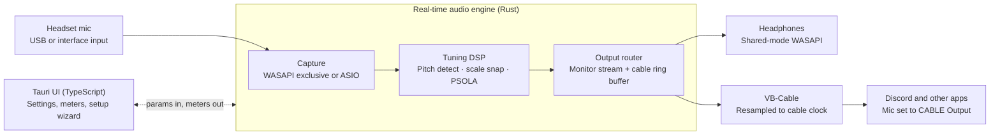

# Real-Time Voice Tuner — Technical Architecture

Sep 27, 2026 · Ben Singer

## Overview

A Windows desktop app, built in Rust with Tauri 2, that pitch-corrects the user's mic in real time. It monitors the tuned voice to their headphones at about 12–20 ms on wired USB headsets, and exposes it to Discord and other apps through VB-Cable.

**Goals (v1)**

- Round-trip monitoring latency of 20 ms or less on a wired USB headset using WASAPI, at the Mid voice range, and 15 ms or less on an interface with a native ASIO driver.
- No audible dropouts in a 1-hour session at default settings.
- One installer: one UAC prompt, a reboot only when Windows needs one, no vendor drivers required.
- Works with any WASAPI capture and render device the user already has.

**Non-goals (v1)**

- A custom kernel audio driver (VB-Cable covers the virtual mic).
- macOS, Linux, and Arm64 Windows builds.
- Low-latency monitoring over Bluetooth (warned about, not supported).
- A VST/CLAP plugin build, recording, or MIDI-driven harmonies.

**Target platform:** Windows 10 22H2 and Windows 11, x64.

## System context



The headphone path never touches VB-Cable, so the cable's buffering only affects what Discord hears. The UI talks to the engine through lock-free channels and never sits on the audio path.

## Latency budget

Target is 20 ms or less from voice to ears on a wired USB headset. The DSP is the fixed floor; everything else is buffering we minimize.

| Stage | ASIO interface | USB headset, tuned | USB headset, fallback |
| --- | --- | --- | --- |
| Capture | \~1 ms (64 smp @ 48 kHz) | \~3 ms (WASAPI exclusive, device min period) | \~10 ms (WASAPI shared) |
| Tuning DSP | \~7–14 ms (voice range preset) | \~7–14 ms (10 ms at Mid) | \~7–14 ms |
| Monitor output | \~1 ms | \~3–10 ms (IAudioClient3 shared, driver-dependent) | \~10 ms |
| Converters / USB | \~1–2 ms | \~2–3 ms | \~2–3 ms |
| **Round trip** | **\~10–18 ms** | **\~15–30 ms (\~18 ms typical at Mid)** | **\~29–37 ms** |

**Discord path:** VB-Cable's internal buffer is set to 2048 samples, capping the cable at about 21 ms. With the resampler, the Discord path adds about 20–40 ms, which is hidden under Discord's own 60–200 ms of codec and network delay.

All figures are estimates. The app measures real round-trip latency with a loopback test tone and shows it in the UI.

## Process and thread model

One process, three real-time audio threads, and a non-real-time control plane. Nothing on an audio thread may allocate, lock, log, or wait on anything but its own WASAPI/ASIO event.

| Thread | Priority | Owns | Talks to |
| --- | --- | --- | --- |
| UI (WebView2) | Normal | TypeScript frontend | Control plane via Tauri commands and events |
| Control plane (Tokio) | Normal | Device enumeration, config, stream start/stop, VB-Cable setup, default-device changes | UI; engine via lock-free queues |
| Capture + DSP | MMCSS "Pro Audio", critical | Capture stream, pitch detection, PSOLA | Writes monitor ring and cable ring |
| Monitor render | MMCSS "Pro Audio", critical | Headphone output stream | Reads monitor ring |
| Cable render | MMCSS "Pro Audio", high | CABLE Input stream, adaptive resampler | Reads cable ring |

**Communication**

- UI to control: typed Tauri commands, with TypeScript bindings generated by `tauri-specta`.
- Control to engine: continuous parameters (key, scale, retune speed, mix) as atomics; discrete commands as an `rtrb` SPSC queue of plain enums.
- Engine to control: meters (input level, detected pitch, corrected pitch, buffer fill, xruns) via a triple buffer, polled at 30 Hz and emitted to the UI as Tauri events.
- Errors and log lines from audio threads go through an SPSC ring and are drained by the control plane.
- Device changes (unplug, default switch, format change) always stop and rebuild streams from the control plane, never from an audio thread.

**Enforcement:** debug builds wrap the audio callbacks in `assert_no_alloc`, so any allocation on an audio thread panics in testing.

## Audio I/O layer

A single `AudioBackend` trait hides the API. WASAPI is the dependable default; ASIO is an automatic upgrade behind a cargo feature.

**Capture: try in order, stop at the first that opens**

1. **ASIO**, if the capture device belongs to an installed ASIO driver. Request 64 samples; the driver may override.
2. **WASAPI exclusive, event-driven**, at the device minimum period (`GetDevicePeriod`). Try float32, then 24-in-32 int, then int16 at 48 kHz via `IsFormatSupported`.
3. **WASAPI shared low-latency** via `IAudioClient3::InitializeSharedAudioStream` at the minimum engine period.
4. **WASAPI shared, standard** (10 ms period).

Each fallback is logged and shown in the UI with its measured latency. Common triggers are `AUDCLNT_E_DEVICE_IN_USE` and "allow exclusive control" being disabled.

**Monitor output**

- `IAudioClient3` low-latency shared mode, falling back to standard shared. Never exclusive in v1, because that would mute game and Discord audio on the same headset.
- ASIO output only when the headphones are on the same ASIO interface as the mic.

**Clocks and formats**

- The engine runs at the capture device's native rate, 48 kHz preferred.
- Same device for mic and headphones (typical USB headset) means one clock: the monitor ring targets one period and no resampling happens.
- Different devices means an adaptive resampler (`rubato`) on the monitor path, steered by a PI loop on ring fill level.

**Device lifecycle**

- `IMMNotificationClient` watches device add, remove, and default changes.
- `AUDCLNT_E_DEVICE_INVALIDATED` on any stream triggers a rebuild from the control plane.
- Audio threads register with `AvSetMmThreadCharacteristicsW("Pro Audio")` and `AvSetMmThreadPriority(AVRT_PRIORITY_CRITICAL)`.

**Crates:** `wasapi` (exclusive and event-driven streams), `windows` (IAudioClient3, device notifications, AVRT), `cpal` with the `asio` feature.

## DSP pipeline

Time-domain PSOLA driven by causal pitch detection. Algorithmic latency is about one period of the lowest supported pitch, so the user's voice range setting directly sets the DSP delay.

**Stages, per block, in order**

1. **Conditioning:** DC blocker, 70 Hz high-pass, and a noise gate with hysteresis.
2. **Pitch detection:** McLeod Pitch Method on the most recent analysis window of already-captured audio. Detection adds no output delay; the correction lands a few ms late, which is inaudible.
3. **Voicing decision:** below the clarity threshold, audio passes through unshifted (consonants, breath, noise). Hard tune lowers the threshold and holds the last note through dropouts of up to 40 ms (ADR 0011).
4. **Target selection:** snap the smoothed pitch to the nearest note in the active key and scale, with a \~20-cent hysteresis band to stop note flip-flopping (none in hard tune, so notes switch exactly at the midpoint).
5. **Retune glide:** move the applied ratio toward the target with a time constant set by retune speed (0 ms = hard robotic snap, up to \~200 ms = natural). Hard tune always uses 0 ms and no humanize.
6. **PSOLA shift:** pitch marks on the input, Hann-windowed grains two periods long, overlap-added at the target spacing. Small shifts keep formants intact. A formant shift resamples each grain by the formant ratio, which moves the spectral envelope but not the pitch.
7. **Mix:** dry/wet mix (default 100% wet).
8. **Effects (ADR 0011):** presence/air EQ and a compressor in series, then doubler, tempo-synced echo and plate reverb as parallel sends. Each send is routed to the headphones, the virtual mic, or both, so the tuner produces two outputs. No effect adds latency; at their defaults they are bit-transparent and idle sends aren't processed.
9. **Output:** a soft limiter on each output, then the bypass crossfade to the raw input.

**Voice range presets set the fixed latency**

| Preset | Lowest pitch | DSP latency |
| --- | --- | --- |
| Low | 70 Hz | \~14 ms |
| Mid (default) | 100 Hz | \~10 ms |
| High | 150 Hz | \~7 ms |

**User parameters:** key, scale (chromatic, major, minor, custom note mask), retune speed, humanize, hard tune, formant, voice range, mix, gate threshold, bypass, and the effects (presence, air, compressor threshold and ratio; doubler level, detune, delay, route; echo level, tempo, note value, feedback, route; reverb level, size, decay, pre-delay, route). Built-in styles set the sound in one click and keep key, range, gate, tempo and routes.

**Implementation rules**

- Lives in its own crate with no I/O or OS dependencies, so it's testable offline.
- All buffers are preallocated at init for the lowest supported pitch; `process()` never allocates.
- f32 throughout, written to autovectorize; no hand SIMD in v1.
- The `pitch-detection` crate's McLeod detector is the starting point; vendor and trim it if profiling shows allocation or excess cost per call.

## Virtual mic integration

The tuned voice reaches other apps by rendering into VB-Cable's "CABLE Input"; apps record from "CABLE Output". The app treats VB-Cable as a required, managed dependency.

**Detection**

- Find both endpoints by friendly name on first run, then persist their endpoint IDs.
- Check whether another process already renders to CABLE Input (`IAudioSessionManager2` session enumeration). If so, warn that the user's existing routing (OBS, music) would conflict, and offer the licensed A+B cables instead.

**Cable writer**

- Shared-mode, event-driven render stream on CABLE Input, running on the cable's own clock.
- An `rubato` async resampler bridges the engine clock to the cable clock. A PI loop on cable-ring fill adjusts the ratio, targeting about two periods of fill.
- VB-Cable's internal buffer should be 2048 samples at 48 kHz (open question: whether this can be set without the control panel).

**Windows default devices**

- Optional "Use for all apps" toggle sets CABLE Output as the default recording device for the console and communications roles via the undocumented `IPolicyConfig` COM interface.
- The previous defaults are saved to config before the change and restored on quit.
- A dirty flag in config means "restore on next launch", so a crash never leaves the user's mic hijacked.
- Per-app routing through `IAudioPolicyConfigFactory` is deferred to v2.
- If the cable disappears while "Use for all apps" is on, the user's own mic is restored at once; it is re-applied when the cable comes back.

**Keeping the cable healthy** ([ADR 0012](decisions/0012-vb-cable-lifecycle.md))

- Windows often makes a new cable the default playback device. The installer saves the defaults before installing VB-Cable and puts back every role that moved onto the cable; the app repeats this at launch and on device changes for 120 s after the cable first appears.
- The setup check flags "Windows plays into CABLE Input" with a one-click fix (`fix_playback_device`).
- `repair_virtual_mic` re-enables a disabled cable, or installs / restarts VB-Cable through the installer's script with one UAC prompt.

**Discord**

- There is no approved API to change Discord's input device, so the setup wizard guides the user: input set to Default or CABLE Output; noise suppression, echo cancellation, and automatic gain control off.
- The wizard confirms success by checking for a Discord capture session on the CABLE Output endpoint, and shows a green check when found.

## Tauri app layer

Rust owns all state; the TypeScript frontend is a thin, typed view over commands and events. The engine keeps running when the window is closed.

**Frontend stack:** React + TypeScript + Vite, shadcn/ui with Tailwind, TanStack Query for command calls, and a `<canvas>` meter driven by `requestAnimationFrame`. Tooling: npm, oxlint, oxfmt, Vitest.

**Commands (typed with `tauri-specta`)**

| Command | Purpose |
| --- | --- |
| `list_devices` | Capture and render endpoints, with ASIO drivers and VB-Cable flagged |
| `get_config` / `set_config` | Read and patch persisted settings |
| `start_engine` / `stop_engine` | Open or close all streams with the fallback chain |
| `set_params` | Partial update of tuning parameters, applied live |
| `run_latency_test` | Loopback test tone; returns measured round trip in ms |
| `run_setup_check` | VB-Cable present, cable conflicts, Discord session, sidetone and Bluetooth warnings |
| `set_route_all_apps` | Toggle the Windows default mic to CABLE Output, with restore |
| `repair_virtual_mic` | Re-enable, install or restart VB-Cable; reports whether Windows needs a restart |
| `fix_playback_device` | Move the default speakers off CABLE Input |
| `open_asio_panel` | Open the active ASIO driver's control panel |

**Events**

- `meters` at 30 Hz: input level, detected pitch, target note, applied correction in cents, buffer fill.
- `engine_status`: running state, backend tier in use, measured latency, xrun count.
- `device_changed` and `error` with a user-facing message.

**Shell features**

- System tray with a tuning on/off toggle; closing the window hides it to the tray.
- Global tuning on/off hotkey (`tauri-plugin-global-shortcut`), changeable while running; tuning and monitoring start off (ADR 0010), single instance (`tauri-plugin-single-instance`), optional launch at login (`tauri-plugin-autostart`).
- Config lives in `%APPDATA%\<app>\config.json` via serde, with a schema version for migrations.
- Tauri capabilities expose only the commands above; the webview loads no remote content.

## Workspace and crate layout

A Cargo workspace where the DSP has no OS dependencies and only `tuner-win` touches undocumented Windows APIs.

```text
voice-tuner/
├─ Cargo.toml            # workspace root
├─ crates/
│  ├─ tuner-dsp/         # pitch detection, scale snap, PSOLA; pure, no OS deps
│  ├─ tuner-audio/       # AudioBackend trait, WASAPI + ASIO backends, rings, resampling
│  ├─ tuner-engine/      # threads, params, meters; wires audio to dsp
│  ├─ tuner-win/         # IPolicyConfig, device notifications, session enumeration, VB-Cable detection
│  └─ tuner-cli/         # headless harness: offline WAV runs, latency test, benchmarks
├─ src-tauri/            # Tauri 2 app: commands, events, tray, config
├─ ui/                   # React + TypeScript + Vite frontend
├─ installer/            # installer scripts, VB-Cable bundling
└─ .github/workflows/    # CI
```

**Dependency direction:** `tuner-dsp` and `tuner-audio` feed `tuner-engine`; `src-tauri` depends on `tuner-engine` and `tuner-win`. Nothing depends on `src-tauri`.

**Key dependencies:** `wasapi`, `windows`, `cpal` (feature `asio`), `rtrb`, `triple_buffer`, `rubato`, `pitch-detection`, `assert_no_alloc`, `hound` (tests), `criterion` (benchmarks), `serde`, `tauri` 2, `tauri-specta`.

## Installer, licensing, distribution

One signed NSIS installer from the Tauri bundler, with install hooks that set up VB-Cable. The user sees one UAC prompt, and a reboot only when the cable doesn't come up without one.

**Install sequence**

1. Install the app per-machine (elevated).
2. Add VB-Audio's publisher certificate to the `TrustedPublisher` store, so the driver install shows no Windows Security prompt.
3. Save the default audio devices (`tunedup.exe --cable snapshot`), then run `VBCABLE_Setup_x64.exe -i -h` silently, unless VB-Cable is already installed. Fail if the driver isn't there afterwards.
4. Record in the registry whether the app installed VB-Cable.
5. Wait for the cable endpoints, restarting the Windows Audio services once if they don't appear, and put back any default Windows moved onto the cable (`--cable settle`).
6. Only if the cable still isn't active: set a first-run flag, then prompt to reboot. After reboot, the app opens straight into the setup wizard.

**Uninstall:** restore any changed default devices, then, only if the app installed VB-Cable, ask whether to remove it, naming apps still recording from CABLE Output. On Yes, move every default off the cable, remove the app, run `-u -h`, and ask for a reboot only if the endpoints don't go away.

**Elevated as another account:** under Windows 11 Administrator Protection, or when another admin approves the UAC prompt, elevated code runs as a different account. Per-user state (the `RunOnce` entry, autostart, config, logs, the WebView2 profile) then goes to the signed-in user, not the elevated account. See [ADR 0009](decisions/0009-elevated-as-another-account.md).

**Signing and updates**

- Code-sign the app and installer to avoid SmartScreen warnings.
- Ship updates with `tauri-plugin-updater`, signed update manifests, hosted on GitHub Releases. CI builds on GitHub Actions.

**Licenses to secure before public release**

| Item | Requirement |
| --- | --- |
| VB-Cable | Distribution/bundle license from VB-Audio (required to bundle, and to pre-trust their certificate) |
| ASIO SDK | Steinberg proprietary license for a closed-source build, or GPLv3 if the app is open-sourced |
| Rust and npm dependencies | License audit in CI with `cargo-deny` and an npm license check |

## Diagnostics and testing

Latency and glitches are measured, not assumed: the app always shows its current latency, and CI proves the DSP offline.

**Latency measurement**

- **Estimated (always on):** capture period + DSP latency + render period + `GetStreamLatency` from both streams, shown in the header.
- **Measured (button):** the user holds an earcup to the mic; the app plays a chirp through the monitor path with the DSP bypassed and cross-correlates the recording to get the true round trip.

**Runtime health**

- Counters for xruns, ring underruns and overruns, and resampler ratio.
- Callback duration histogram (p99 and max) against the period budget.
- `tracing` logs to a rolling file in `%LOCALAPPDATA%`, plus a "Copy diagnostics" button for support.

**Automated tests (CI on GitHub Actions, windows-latest)**

- DSP unit tests with synthetic tones: detected pitch within ±5 cents, correct scale snapping, PSOLA output within ±5 cents of target, algorithmic latency measured with an impulse.
- Golden-file tests: recorded vocal WAVs processed by `tuner-cli` and compared to reference pitch tracks within tolerance.
- A soak test runs `process()` offline for the equivalent of 1 hour with `assert_no_alloc` enabled.
- `criterion` benchmark gate: one 128-sample block must process in under 10% of its duration (under 0.27 ms at 48 kHz).
- `cargo clippy`, `cargo-deny`, oxlint, and Vitest on every PR; the installer builds on every tag.

**Manual hardware matrix (per release)**

Onboard Realtek audio, two or three wired USB gaming headsets, a USB mic such as a Blue Yeti, one ASIO interface (for example Focusrite), and a live Discord call test.

## Risks and open questions

The biggest risks are dependencies outside our control: undocumented Windows APIs, VB-Audio's license terms, and headset drivers stuck at 10 ms.

| Risk | Impact | Mitigation |
| --- | --- | --- |
| `IPolicyConfig` breaks in a Windows update | "Use for all apps" stops working | Isolated in `tuner-win`; on failure, fall back to wizard instructions |
| VB-Audio bundle terms don't work | Can't ship a one-click install | Link-out install for v1; own SYSVAD-based driver in v2 (EV cert + attestation signing) |
| VB-Cable install/removal disturbs the user's audio (default devices, reboots) | No sound after install, wrong devices after removal | Defaults saved and restored around both, audio services restarted instead of a reboot when that is enough, in-app repair (ADR 0012) |
| Headset driver only allows 10 ms shared output | Round trip \~27 ms | v2 "pro mode": exclusive headset output, system audio mixed in by the app via a second cable |
| PSOLA artifacts on big shifts or fast retune | Audible warble | Cap shift range, crossfade on voicing changes, tune on golden files |
| Another app holds the mic exclusively | Exclusive capture fails | Automatic fallback tier with a visible latency warning |
| Discord processing mangles tuned audio | Robotic or gated voice | Setup wizard checklist and session check |

**Open questions**

- [ ] Can VB-Cable's internal buffer size be set without its control panel (registry or command line)?
- [ ] VB-Audio distribution license price and terms.
- [ ] Does Discord's "Default" input follow the console or the communications default role?
- [ ] Product name, and the reference PC spec (CPU, onboard audio) used for the NFR targets.
